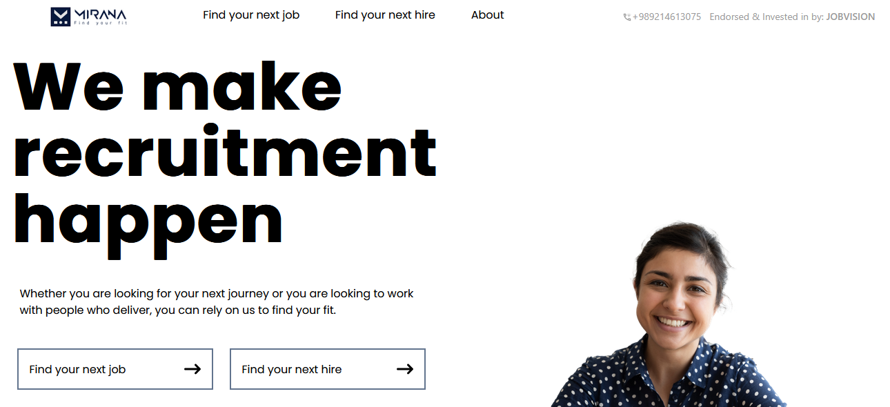

# Mirana Recruitment Platform Simulation

A React-based frontend simulation of [Mirana.ir](https://mirana.ir/), a leading Iranian job recruitment platform with the tagline "We make recruitment happen". This project replicates the core functionality and UI of Mirana's job search platform with modern web technologies.

## ✨ Key Features

- **Tailwind CSS** for responsive, utility-first styling
- **Redux Toolkit** for efficient state management
- Job listing display with filtering capabilities
- Responsive design matching Mirana's layout

- Developed by Mohamad Mokaram

- Created - 2025-10-12

### Technologies Used

- Reactjs, **React-Router**, **Redux-toolkit**, Tailwindcss

- Role - Frontend

### How to reach me

- [linkedin](https://www.linkedin.com/in/mohamad-mokaram-05b873200/), [instagram](https://www.instagram.com/mokaram_frontdeveloper/)
